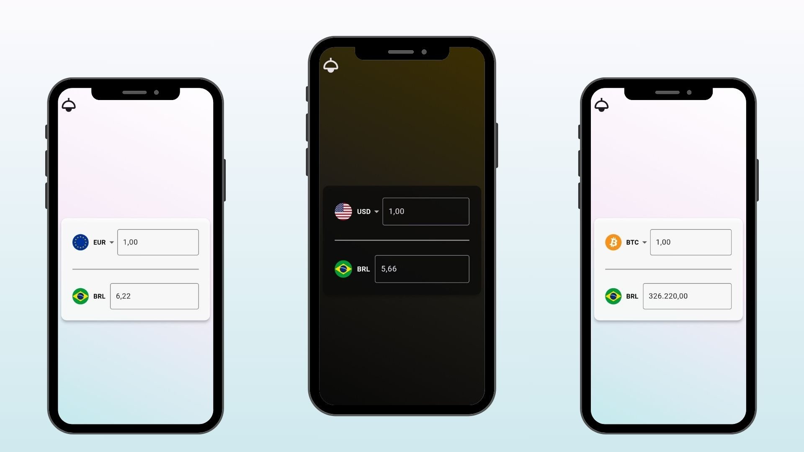

<h1 align="center">App conversor de moedas</h1>



## Sobre o aplicativo
<p>Um aplicativo de conversão de moedas para o real (BRL). O app foi criado com o objetivo de praticar o desenvolvimento mobile em Flutter, utilizando DIO (consumo de API), BLoCs e RxDart (gerenciamento de estados).
Atualmente, o app faz uso da API de cotações da <a href="https://docs.awesomeapi.com.br/api-de-moedas" target = "_blank">AwesomeAPI</a> e conta com as conversões de dólar americano, euro e bitcoin para real, e vice versa.</p>

### Recursos utilizados
- <a href="https://pub.dev/packages/dio" target="_blank">DIO</a>: Requisições a API utilizada
- <a href="https://pub.dev/packages/flutter_bloc" target="_blank">Flutter bloc</a>: Gerenciamento de estados da aplicação
- <a href="https://pub.dev/packages/rxdart" target="_blank">RxDart</a>: Usado para controlar o fluxo de eventos do bloc
- <a href="https://pub.dev/packages/extended_masked_text" target="_blank">Extended Masked Text</a>: Solução simples para aplicar a máscara de texto no formato de moeda

## Instalar
### Apk (Android)
<p>Você pode fazer o download do .apk para dispositivos android <a href="https://drive.google.com/drive/folders/15f-K1Gh9bEDtB9DAMH5HYCjEDUdoLduc?usp=drive_link" target="_blank">aqui</a>.</p>

### Compilar e executar
- #### Faça o download ou clone o repositório
    ```
    git clone https://github.com/Tiegow/Conversor-de-moeda
    ```
    Em seguida, acesse o diretório do projeto:
    ```
    cd Conversor-de-moeda
    ```
- #### Instale as dependências do Flutter
    ```
    flutter pub get
    ```
- #### Execute o projeto usando um emulador ou dispositivo conectado
    ```
    flutter run
    ```
    Se quiser gerar um apk para android, execute:
    ```
    flutter build apk
    ```


**!! Observação:** a versão para IOS ainda não foi testada. Caso esteja em uma plataforma macOS, você pode tentar compilar para IOS com:
```
flutter build ios
```